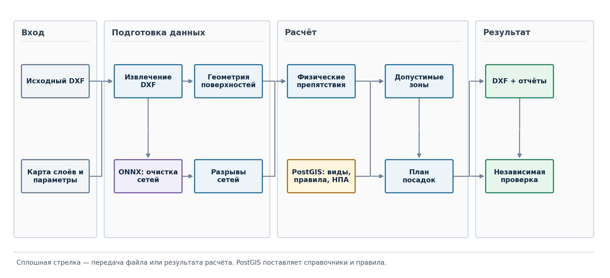

<h1 align="center">Sylvitect-core</h1>

<p align="center"><strong>Вычислительное ядро для проектирования озеленения по DXF</strong></p>

<p align="center">Распознаём объекты чертежа и инженерные сети, рассчитываем допустимые зоны, подбираем посадки и возвращаем DXF с объяснениями каждого решения.</p>

<p align="center"><a href="#что-отличает-решение">Что отличает решение</a> · <a href="#быстрый-запуск">Быстрый запуск</a> · <a href="#как-это-работает">Как это работает</a> · <a href="#что-получается">Что получается</a> · <a href="#границы-применения">Ограничения</a></p>

---

## Задача и результат

План озеленения начинается с чертежа, в котором дороги, здания, покрытия, существующие растения и сети часто разнесены по множеству слоёв и блоков. На таком DXF сложно быстро найти места для деревьев и кустарников и объяснить, почему конкретная точка подходит или не подходит.

**Sylvitect-core — вычислительное ядро платформы Sylvitect.** Оно обрабатывает **локальные координаты DXF** и предлагает посадки внутри границы работ. Полный прогон создаёт новый чертёж с отдельными слоями результата, PDF-паспорт, диагностический DXF и машиночитаемый журнал проверок. Исходный файл остаётся на месте. Ядро запускается через CLI, интерактивное меню или Docker Compose; графический редактор планируется как отдельный интерфейс поверх него.

| Что делает система | Что можно проверить |
|---|---|
| Извлекает геометрию из слоёв и вложенных блоков | Типы найденных объектов, масштаб и источники геометрии |
| Очищает линии водопровода, газа, теплосети и силового кабеля с помощью ONNX-моделей; оценивает разрывы принятых линий водопровода, газа и теплосети | Принятые и отклонённые линии, отчёты реконструкции |
| Вычитает физические препятствия и применяет правила отступов | Допустимые зоны для разных типов посадок и слои `DEBUG_*` |
| Подбирает деревья, кустарниковые массивы и травянистое покрытие | Вид, координаты, ID, причины принятия или отказа, ссылка на применённое правило |
| Собирает копию DXF и повторно проверяет результат | `verification_report.json`, исходные и новые слои в CAD |

## Что отличает решение

- **Восстановление инженерных сетей до расчёта отступов.** Четыре ONNX-классификатора отделяют графику водопровода, газа, теплосети и силового кабеля от шума чертежа. Для принятых линий водопровода, газа и теплосети геометрический алгоритм оценивает разрывы и соединяет только допустимые продолжения. Очищенные и восстановленные линии участвуют в расчёте зон запрета; принятые и отклонённые гипотезы можно посмотреть в диагностическом DXF и отчётах. Разрывы силового кабеля автоматически не достраиваются. [Как устроен этап сетей](docs/for_organizers.md#классификация-и-восстановление-инженерных-сетей).
- **Композиция посадок через OR-Tools CP-SAT.** Генератор предлагает для каждого участка целые схемы деревьев и кустарников: ряды, группы и массивы. Решатель выбирает совместимые схемы с учётом ёмкости и расстояний между ними, сохраняя рисунок посадки, затем каждая выбранная посадка проходит обычные проверки перед экспортом. Оптимизация действует среди предложенных схем и ограничена временем расчёта. [Постановка задачи и диагностика решателя](docs/cp_sat_layout.md).
- **Проверяемое объяснение результата.** Для посадок сохраняются ID, расстояния до препятствий, применённые пороги и ссылки на пункты нормативных правил; для отклонённых кандидатов — причины отказа. Отдельный проверяющий сопоставляет план и итоговый DXF, а диагностические слои показывают исходные ограничения. [Формат объяснений и проверки](docs/for_organizers.md#интерпретируемость-решений).

## Как это работает



1. **Чтение DXF.** Go-экстрактор обходит сущности и разрешённые вложенные блоки; карта слоёв помогает назначить им смысловые типы. Перед расчётом метрических отступов определяется масштаб чертежа.
2. **Подготовка геометрии.** Python-модули строят поверхности дорог, зданий и покрытий. Четыре классификатора в формате ONNX отделяют графику инженерных сетей от шума; разрывы принятых линий оцениваются отдельно.
3. **Зоны и композиция.** Геометрические операции исключают препятствия и строят допустимые зоны по правилам из PostGIS. Генератор формирует кандидатов; для деревьев по умолчанию включён подбор сочетания через OR-Tools CP-SAT. Параметры вида, шага и посадки под кронами задаются отдельно от нормативных отступов.
4. **Объяснение и контроль.** Для каждой принятой посадки сохраняются проверки с фактическим и требуемым расстоянием, кодом правила и ссылкой на нормативный источник. Итоговый DXF, план и объяснения проходят отдельную автоматическую проверку.

Подробные потоки данных и ответственность компонентов описаны в [архитектуре](docs/architecture.md), а карта исходного кода — в [справочнике модулей](docs/modules.md).

## Быстрый запуск

Первый запуск: [START_HERE.md](START_HERE.md). На Windows выполните `init.ps1`, затем `run.ps1`; на Linux — `bash init.sh`, затем `bash run.sh`. Эти команды строят полный план демо-улицы без платной генерации изображений. Архив проекта для передачи собирается командой `python scripts/package_project.py`.

Все команды выполняются **из корня репозитория**. Для локального запуска нужны Python 3.10–3.12, Go и Docker Compose; установщики помогают подготовить окружение. `init.ps1` и `init.sh` скачивают контрольный DXF 3-й Парковой в `Пилотный проект 20 улиц/input_10001759_bound.dxf`, проверяют его размер и SHA-256. Если файл уже проверен, повторной загрузки нет.

<details open>
<summary><strong>Windows · интерактивное меню</strong></summary>

```powershell
.\init.ps1
.\scripts\run_pipeline_interactive.ps1
```

В меню по умолчанию выбран контрольный DXF, полный расчёт и плотная смешанная посадка. Результат появится в `output/latest`; при занятом выходном файле скрипт покажет другой каталог. Для запуска без меню и проверки первого прогона используйте [пошаговую инструкцию](docs/quickstart.md#windows).

</details>

<details>
<summary><strong>Linux · интерактивное меню или одна команда</strong></summary>

```bash
bash init.sh
bash scripts/run_pipeline_interactive.sh
```

Без меню:

```bash
bash scripts/run_pipeline.sh \
  'Пилотный проект 20 улиц/input_10001759_bound.dxf' \
  output/latest --mode full --preset dense_mixed
```

Проверка путей и параметров **без расчёта и запросов на генерацию изображений**: `bash scripts/run_pipeline_interactive.sh --dry-run`. Для МосТех.ОС предусмотрен тот же Linux/Docker-путь; нативный запуск на конкретной сборке ОС требует проверки в её окружении.

</details>

<details>
<summary><strong>Docker Compose · воспроизводимый контейнерный прогон</strong></summary>

```bash
mkdir -p docker-data
cp 'Пилотный проект 20 улиц/input_10001759_bound.dxf' docker-data/input.dxf
docker compose build planner
docker compose up -d --wait postgis
docker compose --profile pipeline run --rm planner \
  /data/input.dxf /data/output --mode full
```

Результат будет в `docker-data/output`. Контейнер `planner` сам загружает каталог растений и правила перед расчётом. Для своего чертежа замените `docker-data/input.dxf` и убедитесь, что его единицы заданы верно; если `$INSUNITS` отсутствует или ошибочен, укажите проверенный `DXF_UNITS_PER_METER`.

После смены имени Compose-проекта Docker создаст отдельный том PostGIS. Прежний том останется на диске; если в базе были собственные изменения, перенесите их отдельно перед новым прогоном.

</details>

## Что получается

Пути ниже приведены относительно каталога результата (`output/latest` при запуске через меню, `docker-data/output` в Docker):

| Файл | Для чего открыть |
|---|---|
| `result_with_planting_plan.dxf` | Полный чертёж с исходной подосновой и новыми слоями посадок `SYLVITECT_*` |
| `planting_diagnostics.dxf` + `planting_diagnostics_legend.md` | Где проходят сети, исключения, принятые и отклонённые кандидаты |
| `sylvitect_planting_report.pdf` | Сводка и объяснения решений о посадках |
| `planting_plan_atlas.pdf` | Иллюстрированный обзор плана по участкам |
| `planting_plan.geojsonl` + `planting_decisions.geojsonl` | Координаты, виды и статусы кандидатов для машинного анализа |
| `planting_explanations.md` | Поиск объяснения по ID посадки |
| `verification_report.json` | Итог независимой проверки; успешный прогон имеет `status: "passed"` и пустой `failures` |
| `blender_gallery/` | Парные ракурсы «до/после» и, если включена генерация, фотореалистичные изображения |

Для проверки откройте сначала `verification_report.json`, затем итоговый DXF в CAD: убедитесь, что исходные слои читаются и появились слои `SYLVITECT_PLANT_TREE`, `SYLVITECT_PLANT_SHRUB` и другие соответствующие результату. В диагностическом DXF слои `DEBUG_*` помогают увидеть, почему участок исключён. Автоматический статус не заменяет просмотр спорных мест на исходной подоснове.

Служебные имена ядра: слои `SYLVITECT_*`, XDATA-приложение `SYLVITECT` и отчёт `sylvitect_planting_report.pdf`. Экспортёр, диагностический чертёж и верификатор используют эти же имена. Результаты прогонов до переименования нужно создать заново; автоматическое чтение старого формата не предусмотрено.

## Почему выбрана конкретная посадка

У каждой принятой посадки есть ID. По нему связываются объект DXF, строка плана, отчёт и набор проверок: отступы от найденных объектов, принятые пороги, вид растения и источник правила. Нормативные ссылки относятся к **правилам отступа**; они сами по себе не подтверждают, что неоднозначный слой входного DXF распознан правильно. Для отклонённых кандидатов сохраняются причины отказа в `planting_decisions.geojsonl` и диагностических слоях.

## Визуализация «до / после»

После расчёта Blender может построить 3D-сцену с одинаковыми камерами для парных ракурсов «до» и «после». При наличии ключа OpenRouter отдельный шаг создаёт более реалистичные изображения с учётом выбранных видов и маски посадок. Ключ задаётся в исключённом из Git файле `config/openai.env` строкой `OPENROUTER_API_KEY=...`; Blender устанавливается отдельно (на Linux: `bash scripts/install.sh --with-blender`).

Это **необязательная платная функция**: DXF, PDF и проверки строятся без ключа и без Blender. Фотографии служат иллюстрацией проекта, а геометрию и отступы следует оценивать по DXF и отчётам. Порядок запуска — в [руководстве по визуализации](src/visualization/README.md).

## Технологии и структура

| Компонент | Роль |
|---|---|
| Go | Извлечение объектов из больших DXF |
| Python, Shapely/GEOS, ezdxf | Геометрия, планирование и выпуск DXF |
| scikit-learn → ONNX Runtime | Обучение и выполнение классификаторов графики сетей |
| OR-Tools CP-SAT | Выбор сочетания кандидатов для композиции |
| PostgreSQL/PostGIS | Каталог видов, правила и ссылки на нормативные документы |
| Docker Compose | Контейнерный запуск базы и одноразового планировщика |
| Blender, OpenRouter | Необязательная визуализация |

Основные точки входа: [`scripts/run_pipeline.ps1`](scripts/run_pipeline.ps1) и [`scripts/run_pipeline.sh`](scripts/run_pipeline.sh). Словарь DXF-объектов находится в [`src/core/config.yaml`](src/core/config.yaml), параметры компоновки — в [`config/planting.json`](config/planting.json), исходники стадий — в [`src/`](src/). Состав ONNX-моделей указан в [метаданных](models/utility_detector/latest/metadata.json), внутренние метрики обучения — в [отчёте](models/utility_detector/latest/training_report.json).

## Границы применения

- Входные чертежи разных улиц не стандартизированы: названия слоёв, вложенные блоки и обозначения отличаются. Ошибочная семантика входа может дать неверную зону даже при успешном завершении расчёта.
- Нужны корректные единицы DXF и граница работ. Для чертежа с внешними ссылками их следует включить в исходный файл до запуска.
- Координаты остаются локальными: привязка к WGS84 автоматически не выполняется. Почва и освещённость участка пока не моделируются.
- Классификаторы обучены на размеченных примитивах; оценка на новых улицах и визуальная проверка реконструкции сетей остаются необходимыми.
- Интерфейс MVP — CLI/меню. Интерактивный CAD-редактор и HTTP API не входят в текущий вычислительный контур.

Следующие шаги: проверка на большем числе улиц, расширение правил для других сетей, устойчивый импорт DWG/XREF, подтверждённая геопривязка и редактор посадок с повторной проверкой после правок.

---

**Начать:** [пошаговый первый прогон](docs/quickstart.md) · [архитектура](docs/architecture.md) · [модули](docs/modules.md)
