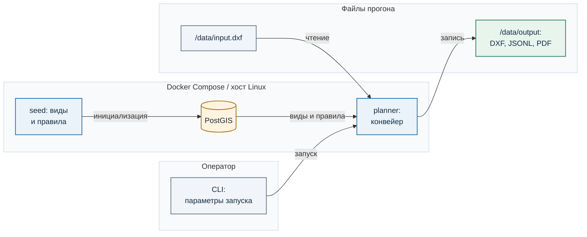

# Архитектура Sylvitect-core

Sylvitect-core — вычислительное ядро платформы Sylvitect: пакетный конвейер DXF → план озеленения → DXF. Оркестратор запускает изолированные Go- и Python-процессы, передавая результаты через файлы в каталоге прогона. PostGIS хранит каталог растений, нормативные документы и правила отступов; вычислительная геометрия выполняется локально через GEOS. Отдельного HTTP API, постоянно работающего сервера и обязательного CAD-плагина в вычислительном контуре нет.

Документ описывает реализованную систему. [Сквозной процесс](for_organizers.md#сквозной-процесс-от-dxf-до-результата), [алгоритмы](for_organizers.md#алгоритмы), [матрица требований к посадкам](planting_requirements_matrix.md), [контракты файлов](data_contracts.md) и [инструкция запуска](development.md) вынесены отдельно, чтобы архитектурный уровень оставался обзорным.

## Компонентная схема

```mermaid
%% diagram:system_design
flowchart LR
    subgraph input["Вход"]
        direction TB
        dxf["Исходный DXF"]
        config["Карта слоёв и<br/>параметры"]
    end
    subgraph prepare["Подготовка данных"]
        direction TB
        extract["Извлечение<br/>DXF"]
        normalize["Геометрия<br/>поверхностей"]
        model["ONNX: очистка<br/>сетей"]
        reconstruct["Разрывы<br/>сетей"]
    end
    subgraph calculate["Расчёт"]
        direction TB
        constraints["Физические<br/>препятствия"]
        rules["Допустимые<br/>зоны"]
        database[("PostGIS: виды,<br/>правила, НПА")]
        planner["План<br/>посадок"]
    end
    subgraph deliver["Результат"]
        direction TB
        export["DXF + отчёты"]
        verify["Независимая<br/>проверка"]
    end

    dxf -->|DXF| extract
    config --> extract
    extract -->|объекты| normalize
    extract --> model
    model -->|принятые| reconstruct
    normalize --> constraints
    reconstruct --> constraints
    constraints -->|базовая зона| rules
    database -->|отступы| rules
    database -->|виды| planner
    rules -->|зоны по типам| planner
    planner -->|план| export
    planner --> verify
    export -->|итоговый DXF| verify

    classDef source fill:#f1f5f9,stroke:#64748b,stroke-width:1.5px,color:#142b43
    classDef process fill:#eaf3fa,stroke:#256b9a,stroke-width:1.5px,color:#142b43
    classDef model fill:#f1ecfa,stroke:#7657a5,stroke-width:1.5px,color:#142b43
    classDef data fill:#fff4df,stroke:#a66b13,stroke-width:1.5px,color:#142b43
    classDef output fill:#e7f5ed,stroke:#23805a,stroke-width:1.5px,color:#142b43
    classDef warning fill:#fdf0ed,stroke:#b45346,stroke-width:1.5px,color:#142b43
    class dxf source
    class config source
    class extract process
    class normalize process
    class model model
    class reconstruct process
    class constraints process
    class rules process
    class database data
    class planner process
    class export output
    class verify output
    style input fill:#f8fafc,stroke:#cbd5e1,stroke-width:1px
    style prepare fill:#f8fafc,stroke:#cbd5e1,stroke-width:1px
    style calculate fill:#f8fafc,stroke:#cbd5e1,stroke-width:1px
    style deliver fill:#f8fafc,stroke:#cbd5e1,stroke-width:1px
```

<!-- diagram:system_design:start -->

<!-- diagram:system_design:end -->

Стрелки обозначают передачу файлов или чтение правил. Модель ONNX классифицирует линии инженерных сетей; достройка разрывов выполняется следующим геометрическим компонентом. Построение разрешённых зон и проверка посадок используют один и тот же масштаб DXF и версии правил.

| Компонент | Реализация | Ответственность | Выходной контракт |
|---|---|---|---|
| Оркестратор | `scripts/run_pipeline.ps1`, `scripts/run_pipeline.sh` | Порядок стадий, параметры, отказ при ошибке, каталог результатов | Отчёты стадий и статус прогона |
| Извлечение DXF | `parser/dxf_extract_go` | Слои, вложенные блоки, примитивы и кандидаты поверхностей | `extracted_objects.jsonl`, `surface_candidates_raw.jsonl` |
| Нормализация | `src/geometry/normalizer.py` | Геометрия в локальных координатах, типы объектов, ремонт допустимых контуров | `normalized_objects.geojsonl` |
| Классификация сетей | `src/detection/utilities/detector.py`, ONNX bundle | Оценка векторных примитивов воды, газа, тепла и силового кабеля | Принятые, спорные и отклонённые линии |
| Реконструкция сетей | `src/detection/network_reconstructor.py` | Соединители разрывов и врезок принятых линий с оценкой гипотезы | `reconstructed_utilities.geojsonl` |
| Физические ограничения | `src/geometry/constraint_builder.py` | Дорога, покрытия, здания, тротуары, колодцы и базовая зона | `constraint_map.geojsonl`, отчёт источников |
| Нормативные зоны | `src/rules/plant_allow_zone.py`, PostGIS | Отступы по типам растений, буферы, исключения и статус каждого правила | `plant_allow_zones.geojsonl` |
| Планировщик | `src/planting/service.py`, `placement_generator.py` | Виды растений, геометрия посадок, композиция и решение по кандидату | План, решения, трасса компоновки |
| Экспорт и контроль | `src/cad_io`, `scripts/verify_outputs.py` | Копия DXF, объяснения, отчёты и независимая проверка | Итоговый DXF, PDF, `verification_report.json` |

`src/pipeline/stages.py` и `src/pipeline/artifacts.py` задают вспомогательные контракты; они не заменяют исполняемые сценарии оркестрации. Визуализация Blender и внешняя генерация изображений запускаются после расчёта и не влияют на геометрическое решение.

## Поток данных

1. **Подготовка входа.** Сценарий определяет единицы DXF, затем Go-экстрактор читает семантические объекты и кандидаты поверхностей. Конфигурация слоёв ограничивает извлечение, чтобы условные знаки и элементы оформления не стали объектами местности.
2. **Геометрия и сети.** Нормализатор строит геометрические объекты. Отдельный этап классифицирует примитивы сетей; только принятые линии передаются реконструктору. Для силового кабеля автоматическое соединение разрывов отключено, его принятая геометрия передаётся дальше без достройки. Гипотезы воздушной ЛЭП сохраняются отдельно и не становятся нормативной трассой без подтверждения типа и напряжения.
3. **Ограничения.** Из подтверждённой пригодной поверхности внутри границы работ вычитаются физические препятствия. При отсутствии поверхности используется помеченный резервный путь. Восстановление дороги сопровождается статусом качества и необходимостью визуального контроля.
4. **Правила.** Для каждого типа посадки PostGIS возвращает применимые правила. Геометрический буфер строится только при пригодном источнике; зона после вычитания и статус правила сохраняются для проверки.
5. **План.** Планировщик выбирает вид и компоновку, предлагает точки или площадные массивы, проверяет габарит, соседние растения и активные отступы. Принятые и отклонённые кандидаты записываются с ID и причинами.
6. **Вывод и проверка.** Экспортёр добавляет слои результата `SYLVITECT_*` в копию исходного DXF. Верификатор повторно читает промежуточные файлы и итоговый чертёж, проверяет зоны, расстояния, объяснения и сохранение исходных сущностей. PDF и атлас строятся из тех же артефактов прогона.

Файлы между стадиями намеренно сохраняются на диске. Это даёт воспроизводимую границу компонента: при расхождении можно сравнить конкретный вход и выход, не восстанавливая состояние процесса из журнала. Форматы, ID и статусы перечислены в [контрактах данных](data_contracts.md).

## Границы ответственности и инварианты

- **Координаты и масштаб.** Все геометрические артефакты используют локальные координаты исходного DXF. Они не становятся WGS84 без отдельной привязки. Масштаб подтверждается по `$INSUNITS` либо задаётся явно; метрические отступы переводятся в единицы чертежа до геометрических операций. Неизвестный масштаб останавливает расчёт.
- **Источник геометрии.** Для каждой поверхности и сети хранится происхождение: исходный CAD-объект, результат модели или геометрическая гипотеза. Классификация ONNX сама не создаёт продолжения трубы. Сырые линии сетей не служат автоматическим основанием для нормативного буфера: требуется принятая очищенная или восстановленная геометрия.
- **Правило и наблюдение разделены.** PostGIS хранит порог, тип растения и ссылку на документ; CAD-файл поставляет геометрию измерения. Если пригодной геометрии нет, правило остаётся в отчёте со статусом `unavailable` или `manual_review` и численным порогом. Отсутствие объекта в DXF не считается доказанным безопасным расстоянием.
- **Объяснимость.** Каждая посадка получает ID, вид, геометрию и список проверок. Тот же ID связывает запись плана, решение, объяснение и DXF XDATA. `accepted` означает прохождение вычислимых правил для данного входа, а не юридическое согласование проекта.
- **Сохранность исходника.** Экспортёр пишет новый файл и собственные слои `SYLVITECT_*`. Полный режим сравнивает исходные сущности с выходным DXF; облегчённый оверлей не подтверждает сохранность подосновы.

## Развёртывание

<!-- diagram:deployment:start -->

<!-- diagram:deployment:end -->

Docker Compose поднимает PostGIS, выполняет одноразовый `seed` и запускает одноразовый `planner`. Планировщик читает `/data/input.dxf`, пишет результаты в `/data/output` и обращается к PostGIS по `DATABASE_URL`. На Windows аналогичный расчёт запускает `run_pipeline.ps1`; он может повторно использовать проверенный кэш подготовки. CLI — системная граница: клиент передаёт путь DXF, каталог вывода, режим и при необходимости запрос на посадку. HTTP API и Kubernetes-манифестов в текущей реализации нет.

| Режим Windows | Подготовка | DXF-результат | Сравнение исходных сущностей |
|---|---|---|---|
| `full` | Полный перерасчёт | `result_with_planting_plan.dxf` | Да |
| `lean` | Полный расчёт без тяжёлой диагностики | `planting_overlay.dxf` | Нет |
| `fast` | Проверенный кэш подготовки обязателен | `planting_overlay.dxf` | Нет |
| `auto` | Кэш при совпадении, иначе полный расчёт | Зависит от фактического режима | Только при фактическом `full` |

Ключ кэша учитывает входной DXF, масштаб, код и конфигурацию подготовки, ONNX bundle и ручные исправления дороги. `pipeline_run_parameters.json` фиксирует запрошенный и фактический режим; `pipeline_stage_timings.json` — длительность и статус стадий. Правила в уже созданной PostGIS обновляются повторным запуском `scripts/seed.py`, а не изменением исходника само по себе. Инструкция с командами находится в [разделе запуска](development.md).

## Контроль качества и поведение при ошибке

Верификатор запускается до планирования для проверки зон и после экспорта для проверки посадок и DXF. Он контролирует попадание в разрешённую геометрию, габариты растений, расстояния между посадками, полноту объяснений и соответствие итогового чертежа исходнику в полном режиме. `verification_report.json` является машинно-читаемым итогом; код завершения сценария без него не служит подтверждением качества.

Путь восстановления дороги `explicit_surface_fallback` считается недостаточным основанием и останавливает проверку. Флаг `requires_visual_confirmation=true` у дороги сохраняет требование просмотра даже при успешной автоматической геометрической проверке. Экспортёр проводит `ezdxf.audit()`, но открытие большого итогового файла в целевой версии CAD остаётся отдельной проверкой. Полный Linux/Docker прогон после последнего рефакторинга и запуск непосредственно на МосТех.ОС ещё не зафиксированы; утверждать их как проверенную совместимость нельзя.

Изменение типов CAD-объектов, правил и схем посадки выполняется в соответствующих компонентах таблицы выше. Список файлов конфигурации и тестовых точек входа приведён в [справочнике модулей](modules.md), известные дефекты контрольных чертежей — в [аудите демонстрации](demo_audit.md).
