# BPMN-схема пайплайна Sylvitect-core

Документ описывает процесс обработки чертежа от входного DXF до проверенного плана посадок. Схема использует BPMN-эквивалент со swimlane-дорожками: каждая дорожка показывает ответственность отдельного логического компонента.

## Процесс

```mermaid
flowchart LR
    S((Старт)) --> A[Получить DXF и параметры запуска]

    subgraph L1[Запуск и управление]
      A --> B{Файл доступен?}
      B -- Нет --> E1[Сформировать ошибку входных данных]
      B -- Да --> C[Создать каталог результата и журнал запуска]
    end

    subgraph L2[Подготовка чертежа]
      C --> D[Определить единицы DXF]
      D --> F[Извлечь объекты и свойства слоёв]
      F --> G[Нормализовать геометрию]
      G --> H{Есть обязательные объекты?}
      H -- Нет --> E2[Отчёт о неполном входе]
      H -- Да --> I[Классифицировать объекты]
    end

    subgraph L3[Восстановление и правила]
      I --> J[Восстановить разорванные линии сетей]
      J --> K[Построить границы и исключающие зоны]
      K --> M[Рассчитать допустимые зоны посадки]
      M --> N{Есть допустимая площадь?}
      N -- Нет --> E3[Записать отсутствие посадок и причины]
      N -- Да --> O[Передать зоны генератору вариантов]
    end

    subgraph L4[Планировщик посадок]
      O --> P[Сгенерировать варианты композиций]
      P --> Q[Разместить деревья]
      Q --> R[Передать выбранные деревья в расчёт кустарников]
      R --> T[Сгенерировать варианты массивов кустарников]
      T --> U[CP-SAT выбирает совместимые варианты]
      U --> V[Повторно проверить выбранные точки]
      V --> W{Все точки допустимы?}
      W -- Нет --> X[Отклонить точку и сформировать объяснение]
      W -- Да --> Y[Сформировать принятый план]
      X --> Y
    end

    subgraph L5[Выходные материалы]
      Y --> Z[Записать DXF с планом посадок]
      Y --> Z1[Записать диагностический DXF]
      Y --> Z2[Сформировать отчёт и объяснения]
      Y --> Z3[Сформировать PDF и ведомость площадей]
      Y --> Z4{Включена визуализация?}
      Z4 -- Да --> Z5[Сцена Blender и цветовая маска]
      Z5 --> Z6[Фотореалистичные изображения]
      Z4 -- Нет --> FIN((Финиш))
      Z --> FIN
      Z1 --> FIN
      Z2 --> FIN
      Z3 --> FIN
      Z6 --> FIN
    end

    E1 --> ENDERR((Завершение с ошибкой))
    E2 --> ENDERR
    E3 --> Z2
```

## Дорожки процесса

| Дорожка | Ответственность | Основной результат |
|---|---|---|
| Запуск и управление | Проверка пути, параметров и каталога запуска | Журнал и параметры прогона |
| Подготовка чертежа | Чтение DXF, единицы, объекты и слои | Нормализованные объекты |
| Восстановление и правила | Восстановление сетей, отступы и исключения | Допустимые зоны посадки |
| Планировщик посадок | Варианты композиций и глобальный выбор CP-SAT | Набор принятых точек |
| Выходные материалы | DXF, диагностика, PDF и визуализации | Результаты для проверки и демонстрации |

## Логика шлюзов

### «Файл доступен?»

Если входного DXF нет или путь недоступен, процесс завершается понятной ошибкой. Пустой или случайный результат не создаётся.

### «Есть обязательные объекты?»

Пайплайн проверяет наличие объектов, необходимых для конкретного режима. Если часть слоёв отсутствует, это фиксируется в отчёте; выполнение продолжается только при наличии минимального набора для выбранного сценария.

### «Есть допустимая площадь?»

Если после защитных отступов и исключений свободной площади нет, посадки не создаются. В отчёт попадает причина: коммуникация, дорога, здание, существующая растительность или недостаточная ширина зоны.

### «Все точки допустимы?»

После работы планировщика каждая выбранная точка повторно проверяется. Отклонённые точки не попадают в итоговый слой посадок; для них сохраняются идентификатор, причина и ссылка на правило.

### «Включена визуализация?»

Blender и внешний генератор изображений запускаются только при включённой опции. Основной DXF-пайплайн не зависит от наличия API-ключа для визуализации.

## Состав варианта размещения

Вариант размещения — это автоматически рассчитанный полный набор координат для одного участка. Он может быть линейным рядом, группой деревьев, сеткой кустарников или связным массивом. Для каждого варианта сохраняются тип композиции, координаты, количество растений и оценка качества.

CP-SAT выбирает не отдельные точки, а совместимый набор вариантов. Ограничения не позволяют выбрать несколько вариантов для одного участка, нарушить защитные расстояния или превысить общий лимит растений. После выбора выполняется повторная геометрическая проверка.

## Выходные данные

- итоговый DXF со слоями плана посадок;
- диагностический DXF с допустимыми зонами, исключениями и причинами отказа;
- отчёт по каждой посадке и файл объяснений;
- PDF-отчёт и ведомость площадей;
- журнал этапов и времени выполнения;
- при включённой опции — сцена Blender, маска посадок и фотореалистичные изображения.

## Обработка ошибок

Ошибки входного файла, отсутствующие обязательные объекты и отсутствие допустимой площади фиксируются отдельно от ошибок отдельных точек. Это позволяет получить диагностический отчёт даже тогда, когда часть территории не может быть засажена.
