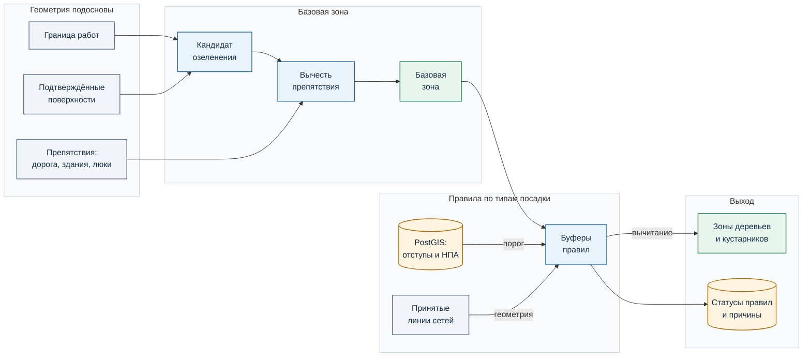
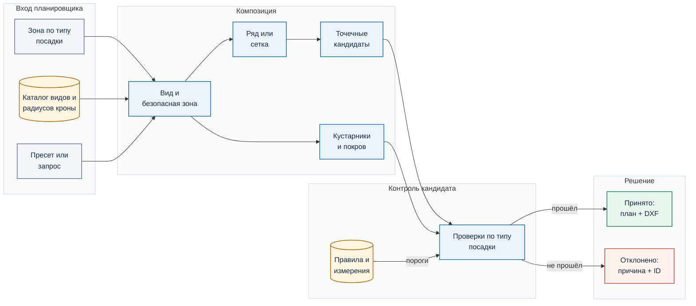
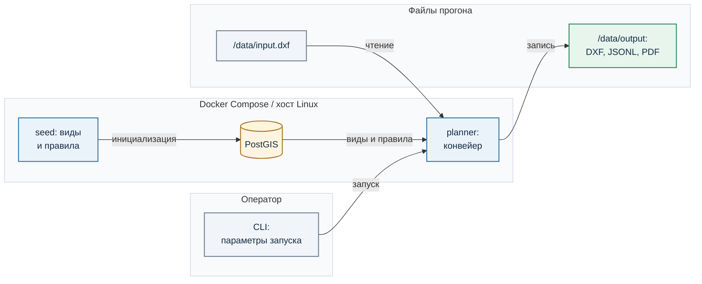

# Sylvitect-core: архитектура и алгоритмы

**Версия: 29 сентября 2026 г.** Sylvitect-core — вычислительное ядро платформы Sylvitect. Оно строит план озеленения из топографической подосновы DXF. Документ описывает путь от исходного чертежа до нового DXF, правила принятия решений, проверку результата и границы применимости. Промежуточные файлы сохраняются: решение можно проследить до исходной геометрии и конкретной проверки.

## Назначение и границы

Sylvitect-core принимает DXF с топографической подосновой и предлагает план озеленения в пределах границы работ. Конвейер извлекает объекты чертежа, отделяет линии инженерных сетей от графического мусора, восстанавливает часть неполной геометрии, исключает физические препятствия и применяет настроенные правила отступов. Затем он размещает растения и выпускает копию DXF, объяснения решений и отчёты проверки. Исходный DXF не перезаписывается.

Расчёт и проверка плана работают без генератора изображений. Визуализация — отдельный необязательный шаг: Blender строит парные кадры «до/после» из рассчитанного плана, а внешний генератор может сделать изображения более реалистичными. Изображения не служат доказательством соблюдения отступов.

### В MVP

- Извлечение объектов DXF с помощью Go-парсера; нормализация геометрии зданий, дорог, покрытий и препятствий.
- Очистка графики водопровода, газопровода, теплосети и силового кабеля четырьмя классификаторами RandomForest в формате ONNX; восстановление допустимых коротких разрывов отдельных сетей.
- Расчёт допустимых зон по настроенным правилам из PostGIS; подбор деревьев, кустарниковых массивов и травянистого покрытия с учётом вида, отступов и композиции. План задаётся пресетом или запросом.
- Копия DXF со слоями Sylvitect-core, ID и объяснением каждой посадки, PDF-отчёт и независимая автоматическая проверка. Основной интерфейс — CLI; контейнерная упаковка — Docker Compose.
- Дополнительная визуализация рассчитанного плана: парные Blender-кадры «до/после» и необязательная фотореалистичная обработка изображений.

### В следующих релизах

- Проверить работу на всех 20 улицах и собрать набор чертежей для повторных проверок после изменений алгоритма.
- Улучшить распознавание инженерных сетей на новых размеченных чертежах.
- Сделать редактор, в котором можно перемещать посадки, менять растения и сразу видеть результаты проверки.
- Добавить расчёт ограничений для канализации, водостока и линий связи.
- Упростить загрузку исходных DWG/DXF, включая чертежи с внешними ссылками и нестандартными слоями.
- Привязать локальные координаты чертежей к городской карте при наличии достоверных опорных точек.

## Компоненты системы

```mermaid
%% diagram:system_design
flowchart LR
    subgraph input["Вход"]
        direction TB
        dxf["Исходный DXF"]
        config["Карта слоёв и<br/>параметры"]
    end
    subgraph prepare["Подготовка данных"]
        direction TB
        extract["Извлечение<br/>DXF"]
        normalize["Геометрия<br/>поверхностей"]
        model["ONNX: очистка<br/>сетей"]
        reconstruct["Разрывы<br/>сетей"]
    end
    subgraph calculate["Расчёт"]
        direction TB
        constraints["Физические<br/>препятствия"]
        rules["Допустимые<br/>зоны"]
        database[("PostGIS: виды,<br/>правила, НПА")]
        planner["План<br/>посадок"]
    end
    subgraph deliver["Результат"]
        direction TB
        export["DXF + отчёты"]
        verify["Независимая<br/>проверка"]
    end

    dxf -->|DXF| extract
    config --> extract
    extract -->|объекты| normalize
    extract --> model
    model -->|принятые| reconstruct
    normalize --> constraints
    reconstruct --> constraints
    constraints -->|базовая зона| rules
    database -->|отступы| rules
    database -->|виды| planner
    rules -->|зоны по типам| planner
    planner -->|план| export
    planner --> verify
    export -->|итоговый DXF| verify

    classDef source fill:#f1f5f9,stroke:#64748b,stroke-width:1.5px,color:#142b43
    classDef process fill:#eaf3fa,stroke:#256b9a,stroke-width:1.5px,color:#142b43
    classDef model fill:#f1ecfa,stroke:#7657a5,stroke-width:1.5px,color:#142b43
    classDef data fill:#fff4df,stroke:#a66b13,stroke-width:1.5px,color:#142b43
    classDef output fill:#e7f5ed,stroke:#23805a,stroke-width:1.5px,color:#142b43
    classDef warning fill:#fdf0ed,stroke:#b45346,stroke-width:1.5px,color:#142b43
    class dxf source
    class config source
    class extract process
    class normalize process
    class model model
    class reconstruct process
    class constraints process
    class rules process
    class database data
    class planner process
    class export output
    class verify output
    style input fill:#f8fafc,stroke:#cbd5e1,stroke-width:1px
    style prepare fill:#f8fafc,stroke:#cbd5e1,stroke-width:1px
    style calculate fill:#f8fafc,stroke:#cbd5e1,stroke-width:1px
    style deliver fill:#f8fafc,stroke:#cbd5e1,stroke-width:1px
```

<!-- diagram:system_design:start -->

<!-- diagram:system_design:end -->

Пакетный сценарий управляет стадиями, а результат каждой стадии записывается отдельно. Go-экстрактор читает большие DXF и разворачивает вложенные объекты. Python-модули нормализуют геометрию, выполняют классификацию ONNX, вычисляют ограничения и план. PostGIS хранит каталог растений, правила и ссылки на нормативные документы. Последняя стадия добавляет результат в копию DXF и независимо проверяет её.

| Компонент | Ответственность | Основной результат |
|---|---|---|
| `parser/dxf_extract_go` | Слои, блоки, CAD-примитивы и кандидаты поверхностей | `extracted_objects.jsonl`, `surface_candidates_raw.jsonl` |
| `src/geometry` | Нормализация, здания, дорога, твёрдые покрытия и препятствия | `normalized_objects.geojsonl`, `constraint_map.geojsonl` |
| `src/detection` | Классификация графики сетей и отдельное восстановление разрывов | `cleaned_utilities.geojsonl`, `reconstructed_utilities.geojsonl` |
| `src/rules` + PostGIS | Правила отступов и допустимые зоны по типам посадки | `plant_allow_zones.geojsonl` |
| `src/planting` | Подбор растений, композиция, проверки точек и площадей | `planting_plan.geojsonl`, `planting_decisions.geojsonl` |
| `src/cad_io` и верификатор | DXF, паспорта, отчёты и повторная проверка результата | `result_with_planting_plan.dxf`, `verification_report.json` |

### Поток обработки

Единицы DXF определяются до любых метрических буферов. Если масштаб не подтверждён, его надо указать явно. На последующих стадиях сохраняются исходный объект, тип геометрии и основание вывода: подтверждённая поверхность, классификация модели или геометрическая гипотеза. Такое разделение позволяет не выдавать восстановленную дорогу или провод за измеренный объект.

## Сквозной процесс: от DXF до результата

```mermaid
%% diagram:process_flow
flowchart LR
    subgraph input["Вход и масштаб"]
        direction TB
        source_dxf["Исходный DXF"]
        units["Единицы и<br/>граница работ"]
        input_config["Карта слоёв и<br/>запрос посадки"]
    end
    subgraph prepare["Подготовка геометрии"]
        direction TB
        extract["Go: объекты и<br/>поверхности"]
        normalize["Нормализация<br/>геометрии"]
        classify["ONNX: очистка<br/>сетей"]
        reconstruct["Разрывы и<br/>врезки сетей"]
    end
    subgraph decide["Расчёт и решение"]
        direction TB
        constraints["Препятствия<br/>и дорога"]
        zones["Зоны по видам<br/>посадки"]
        zone_verify["Проверка<br/>зон"]
        plan["Вид и<br/>композиция"]
        checks["Проверки и<br/>объяснения"]
    end
    subgraph release["Выпуск"]
        direction TB
        result_dxf["Новый DXF"]
        verify["Независимая<br/>проверка"]
        reports["PDF, атлас,<br/>JSONL"]
    end
    subgraph bonus["Визуализация"]
        direction TB
        scene["Сцена и<br/>камеры"]
        blender["Blender:<br/>до / после"]
        ai["AI: материалы<br/>и свет"]
    end

    source_dxf --> units
    units --> extract
    input_config --> extract
    extract --> normalize
    extract --> classify
    classify --> reconstruct
    normalize --> constraints
    reconstruct --> constraints
    constraints --> zones
    zones --> zone_verify
    zone_verify -->|passed| plan
    input_config -->|параметры| plan
    plan --> checks
    checks -->|принятые| result_dxf
    result_dxf --> verify
    verify -->|passed| reports
    verify -->|необязательно, отдельный запуск| scene
    scene --> blender
    blender -->|необязательно| ai

    classDef source fill:#f1f5f9,stroke:#64748b,stroke-width:1.5px,color:#142b43
    classDef process fill:#eaf3fa,stroke:#256b9a,stroke-width:1.5px,color:#142b43
    classDef model fill:#f1ecfa,stroke:#7657a5,stroke-width:1.5px,color:#142b43
    classDef data fill:#fff4df,stroke:#a66b13,stroke-width:1.5px,color:#142b43
    classDef output fill:#e7f5ed,stroke:#23805a,stroke-width:1.5px,color:#142b43
    classDef warning fill:#fdf0ed,stroke:#b45346,stroke-width:1.5px,color:#142b43
    class source_dxf source
    class units process
    class input_config source
    class extract process
    class normalize process
    class classify model
    class reconstruct process
    class constraints process
    class zones process
    class zone_verify process
    class plan process
    class checks process
    class result_dxf output
    class verify process
    class reports output
    class scene process
    class blender output
    class ai output
    style input fill:#f8fafc,stroke:#cbd5e1,stroke-width:1px
    style prepare fill:#f8fafc,stroke:#cbd5e1,stroke-width:1px
    style decide fill:#f8fafc,stroke:#cbd5e1,stroke-width:1px
    style release fill:#f8fafc,stroke:#cbd5e1,stroke-width:1px
    style bonus fill:#f8fafc,stroke:#cbd5e1,stroke-width:1px
```

<!-- diagram:process_flow:start -->

<!-- diagram:process_flow:end -->

Схема разделяет обязательный расчёт и дополнительную визуализацию. В основном конвейере нет обращения к генератору изображений. Он может быть запущен отдельно **после** проверки DXF и читает уже зафиксированные посадки. Таблица ниже показывает точки контроля и сохранённые артефакты; при ошибке стадии сценарий завершается, а более поздние файлы в повторно используемом каталоге могут относиться к прежнему прогону.

<!-- pagebreak -->

| Этап | Вход и решение | Сохраняемый результат или контроль отказа |
|---|---|---|
| 1. Единицы | `$INSUNITS` либо подтверждённый явный масштаб; все нормативные метры переводятся в единицы чертежа | `dxf_units_report.json`; неизвестный масштаб останавливает расчёт |
| 2. Извлечение | Go читает modelspace и разрешённые вложенные блоки по словарю слоёв; отдельно собирает кандидаты поверхностей | `extracted_objects.jsonl`, `surface_candidates_raw.jsonl`; отсутствие обязательных типов — ошибка |
| 3. Подготовка геометрии | Нормализация линий, контуров, зданий и объектов среды; отдельно ONNX-классификация графики сетей и геометрическая реконструкция принятых линий | `normalized_objects.geojsonl`, `cleaned_utilities.geojsonl`, `reconstructed_utilities.geojsonl` и отчёты качества |
| 4. Физические препятствия | Граница работ и пригодные поверхности пересекаются; дороги, покрытия, здания, люки и камеры исключаются | `constraint_map.geojsonl`, `constraint_report.json`; резервная поверхность и восстановленная дорога получают статус качества |
| 5. Правила | Для каждого типа посадки читаются действующие правила PostGIS; по пригодной геометрии строятся запретные буферы и допустимые зоны | `plant_allow_zones.geojsonl`, `plant_allow_zones_report.json`, затем `zone_verification_report.json` |
| 6. Композиция | Каталог, пресет или явный запрос задают вид; планировщик выбирает ряд, сетку либо площадной массив и проверяет кандидатов | `planting_plan.geojsonl`, `planting_decisions.geojsonl`, `planting_layout_trace.jsonl`, `planting_explanations.md` |
| 7. Выпуск и контроль | Результат пишется на новые слои копии DXF; повторно проверяются план, объяснения, зоны и сохранность исходных сущностей в полном режиме | `result_with_planting_plan.dxf`, `verification_report.json`; только `status = passed` означает прохождение автоматической проверки |
| 8. Представление | После успешной проверки из файлов плана создаются человекочитаемые материалы | `sylvitect_planting_report.pdf`, `planting_plan_atlas.pdf`, ведомость площадей |
| Необязательный бонус | Отдельный запуск строит сцену и камеры, Blender-виды «до/после»; внешний генератор может доработать свет и материалы | `scene.json`, PNG и `gallery_index.json`; изображения не заменяют проверку DXF |

<!-- pagebreak -->

## Алгоритмы

Расчёт состоит из трёх независимых решений: какие линии являются сетями, где после учёта препятствий допустима посадка и какую композицию можно разместить внутри этих зон. На схемах показаны входы, критерии отбора и сохраняемые результаты каждого этапа.

### Работа со слоями и исходной геометрией DXF

`src/core/config.yaml` задаёт **семантический словарь**. Для каждого типа указаны допустимый источник (`modelspace` или разрешённые блоки геоподосновы), имя или шаблон слоя, тип CAD-сущности, ожидаемая геометрия и преобразование. После `Bind` парсер сравнивает `layer_tail` — часть имени после последнего `$0$`; так находится исходный слой внутри связанного блока. Второй профиль, `src/core/surface_inspector_config.yaml`, извлекает более широкий набор HATCH и замкнутых контуров **как кандидатов**, которые затем классифицируются по геометрии и контексту.

| Семантический объект | Типичный слой или источник | Роль в расчёте |
|---|---|---|
| Граница работ | `ДВ_ГП_П_Граница работ` либо подтверждённый аналог | Обрезает территорию; обязательна для данного профиля |
| Здания | `Топо_Здания`, `Здания` | Контуры собираются в пятна; внутренние детали слоя «Части зданий» не подмешиваются автоматически |
| Край дороги | `Топо_Бортовой камень`, `Бортовой камень` | Основа реконструкции проезжей части и отдельного отступа |
| Тротуар и покрытия | Проектные HATCH/полилинии из настроенного профиля | Исключение твёрдой поверхности; тротуар определяется по имени слоя и расположению |
| Существующие деревья и растительность | Топографические символы и границы | Центры деревьев и существующие площади ограничивают новый план |
| Инженерные сети | Настроенные типы воды, газа, тепла, кабеля | Сырые линии сначала очищаются моделью; нормативный буфер не строится по всему исходному слою |

Извлечённая запись сохраняет `source_layer`, `source_layer_tail`, CAD-тип, `handle` и путь вложенных блоков. Поэтому спорную зону можно вернуть к конкретному объекту чертежа. Состав слоёв зависит от улицы: при отсутствии типа, помеченного `required` в профиле, извлечение завершается ошибкой.

### Классификация и восстановление инженерных сетей

```mermaid
%% diagram:utility_algorithm
flowchart LR
    subgraph input["Графика"]
        direction TB
        raw["Примитивы<br/>сетей"]
    end
    subgraph classify["Модель"]
        direction TB
        features["19 признаков<br/>геометрии и графа"]
        onnx["ONNX:<br/>вероятность"]
        accepted["Принято"]
        review["Спорно /<br/>отклонено"]
    end
    subgraph geometry["Реконструкция"]
        direction TB
        endpoints["Свободные<br/>концы"]
        candidates["Продолжение<br/>или врезка"]
        selection["Оценка<br/>соединений"]
    end
    subgraph result["Выход"]
        direction TB
        clean["Оси сети +<br/>соединители"]
        trace[("Гипотезы<br/>и причины")]
    end

    raw --> features
    features --> onnx
    onnx -->|порог| accepted
    onnx --> review
    accepted -->|кроме кабеля| endpoints
    endpoints -->|зазор + угол| candidates
    candidates --> selection
    selection --> clean
    selection --> trace
    accepted -->|кабель: без достройки| clean

    classDef source fill:#f1f5f9,stroke:#64748b,stroke-width:1.5px,color:#142b43
    classDef process fill:#eaf3fa,stroke:#256b9a,stroke-width:1.5px,color:#142b43
    classDef model fill:#f1ecfa,stroke:#7657a5,stroke-width:1.5px,color:#142b43
    classDef data fill:#fff4df,stroke:#a66b13,stroke-width:1.5px,color:#142b43
    classDef output fill:#e7f5ed,stroke:#23805a,stroke-width:1.5px,color:#142b43
    classDef warning fill:#fdf0ed,stroke:#b45346,stroke-width:1.5px,color:#142b43
    class raw source
    class features process
    class onnx model
    class accepted output
    class review warning
    class endpoints process
    class candidates process
    class selection process
    class clean output
    class trace data
    style input fill:#f8fafc,stroke:#cbd5e1,stroke-width:1px
    style classify fill:#f8fafc,stroke:#cbd5e1,stroke-width:1px
    style geometry fill:#f8fafc,stroke:#cbd5e1,stroke-width:1px
    style result fill:#f8fafc,stroke:#cbd5e1,stroke-width:1px
```

<!-- diagram:utility_algorithm:start -->

<!-- diagram:utility_algorithm:end -->

Модель получает **отдельный векторный CAD-примитив**. Из длины, формы, направления, окружения и связности концов формируются 19 числовых признаков. Обученный классификатор `RandomForest` сохраняется в ONNX; рядом лежит JSON с порядком признаков, типами сетей и порогами. Классификация делит элементы на принятые (`accepted`), спорные (`manual_review`) и отвергнутые (`rejected`). В автоматическую реконструкцию проходят только принятые. Статус `manual_review` обозначает неопределённость классификации.

Реконструктор ищет свободные концы, которые не примыкают к исходной линии в пределах допуска. Он рассматривает продолжение линии через короткий пропуск и врезку в другую линию. Кандидат должен укладываться в ограничения по длине и углу; оценка учитывает направление, расстояние и поддержку параллельной трубы. Несколько близких по оценке соединений допустимы как разветвление, поэтому результат сохраняет и исходные параллельные линии, и добавленные соединители. Для каждого соединителя записываются длина разрыва, угол, оценка и признаки неоднозначности. Параметры зависят от типа сети; типовые значения — допуск примыкания 0,05 м, максимальный разрыв 5 м и угол продолжения 12°.

ONNX **не** достраивает линию. Классификация отвечает, какие примитивы считать сетью; геометрический этап отвечает, где есть основания соединить их. Для силового кабеля автоматическая реконструкция разрывов отключена: дальше передаётся принятая очищенная геометрия. Это важно при анализе ложных продолжений и охранных полос.

| Состояние примитива | Что делает следующий этап | Где искать подтверждение |
|---|---|---|
| `accepted` | Передаёт ось сети в расчёт; для разрешённых типов рассматривает достройку коротких разрывов | `cleaned_utilities.geojsonl`, `utility_cleaning_report.json`, `network_reconstruction_report.json` |
| `manual_review` | Сохраняет спорный кандидат отдельно; не превращает его в подтверждённую трассу | `review_utility_graphics.geojsonl` и диагностический DXF |
| `rejected` | Не строит по графическому элементу охранный буфер | `rejected_utility_graphics.geojsonl` |

Модель — собственный набор из четырёх ONNX-файлов в [`models/utility_detector/latest`](../models/utility_detector/latest/metadata.json). [`metadata.json`](../models/utility_detector/latest/metadata.json) фиксирует порядок 19 признаков, версии формата, хэши моделей и пороги по типам сетей; [`training_report.json`](../models/utility_detector/latest/training_report.json) — состав разметки и показатели внутренней валидации. Качество на новом DXF проверяется отдельно по размеченным примитивам. Способ независимой разметки и запуска проверки описан в [`ml/README.md`](../ml/README.md).

### Как определяются места для посадки

<!-- diagram:allow_zone_algorithm:start -->

<!-- diagram:allow_zone_algorithm:end -->

<!-- pagebreak -->

**Допустимая зона** — полигон на чертеже, внутри которого алгоритм может рассматривать посадку определённого типа. Зона дерева показывает возможные положения центра ствола, зона кустарника — территорию для кустов или кустарникового массива. Контуры зон создаются до выбора конкретных растений и раскладки. На следующем этапе планировщик дополнительно проверяет размер кроны или куста, расстояние до соседних посадок и другие ограничения выбранного вида.

Зоны строятся последовательно:

1. **Найти территорию для озеленения.** Алгоритм берёт подтверждённые на чертеже поверхности газона, грунта или озеленения и обрезает их границей работ. Если таких поверхностей нет, в качестве временного кандидата берётся вся граница работ. Этот резервный вариант отмечается в отчёте и не проходит итоговую проверку как подтверждённая озеленяемая поверхность.
2. **Получить базовую зону.** Из найденной территории вычитаются проезжая часть, тротуары, твёрдые покрытия, здания, люки и тепловые камеры. Оставшийся полигон — `base_allowed_area`: общая территория, на которой дальше проверяются правила для растений.
3. **Получить зоны деревьев и кустарников.** Для каждого типа берётся копия базовой зоны. Активные правила задают отступы от объектов чертежа. Алгоритм строит вокруг объекта полосу заданной ширины и вычитает её из зоны соответствующего типа. Для инженерных сетей используются принятые очищенные и восстановленные линии.
4. **Разместить растения.** Планировщик выбирает вид и проверяет конкретные точки или площади внутри полученных зон. Травянистое покрытие рассчитывается отдельно: оно занимает подходящую часть базовой зоны после размещения других растений и исключения существующих растительных полос.

Для теплосети действуют две разные проверки. СП 42.13330.2026 (таблица 6.3) задаёт минимальное расстояние 2 м до дерева и 1 м до кустарника от наружной конструкции сети. Типовые правила охраны коммунальных тепловых сетей (приказ Минстроя России № 197, пункты 4, 6–7) требуют письменного согласия владельца для посадки в охранной зоне не менее 3 м от наружной конструкции. Поскольку такого согласия во входных данных нет, автоматический план исключает точки ближе 3 м и к деревьям, и к кустарникам; диагностические слои `DEBUG_EXCL_*_HEAT_PROTECTION_3` показывают эту полосу. Полный контур восстановленной тепловой камеры также участвует в проверке. Очищенная линия DXF может обозначать ось сети, а не наружную стенку канала: до подтверждения границы владельцем сети результат остаётся геометрической оценкой, а не разрешением на производство работ.

Если объект, нужный для активного правила, не найден, правило получает статус `unavailable`. Геометрия зоны по этому правилу остаётся без вычитания, а в отчёте появляется предупреждение и статус необходимости проверки. Отчёт также перечисляет сети, которые есть в исходных данных, но пока не имеют активного правила. Восстановленная дорога получает отметку о необходимости визуального подтверждения.

Проверить расчёт можно по цепочке: `constraint_map.geojsonl` и `constraint_report.json` показывают базовую зону и вычтенные физические препятствия; `plant_allow_zones.geojsonl` содержит отдельные зоны дерева и кустарника; `plant_allow_zones_report.json` показывает применённые правила, площади до и после вычитания и предупреждения. Диагностический DXF отображает очищенные линии сетей, полосы исключений и итоговые зоны на отдельных `DEBUG_*` слоях.

### Подбор растений и композиция

<!-- diagram:planting_algorithm:start -->

<!-- diagram:planting_algorithm:end -->

Планировщик берёт пресет из `config/planting.json` либо `planting_request.json`, выбирает доступные виды из PostGIS и учитывает климатическую пригодность, рекомендуемый шаг и зрелый радиус кроны. Для каждого вида безопасная область дополнительно сужается на его габарит; существующие деревья и полосы озеленения исключаются по соответствующим правилам. Крупные объекты размещаются первыми, чтобы мелкие посадки не блокировали деревья.

По умолчанию OR-Tools CP-SAT выбирает сочетание целых схем: не более одной на участок, в пределах лимита растений и без конфликтов расстояния между соседними схемами. Оценка учитывает количество растений и композицию. Деревья и кустарники решаются последовательно; вид задаёт профиль. Статус решателя, число вариантов и конфликты записываются в `layout_optimizer_runs` отчёта. Оптимальность относится к предложенным схемам и их оценке; при лимите времени решение может быть допустимым без доказанной оптимальности. Подробности — [выбор схем через CP-SAT](cp_sat_layout.md).

Планировщик формирует несколько схем каждого участка: линейную посадку, повторяемые группы по три или пять деревьев, свободную группу либо одиночный акцент. Варианты строятся в пределах допустимой зоны и сравниваются по числу деревьев, ритму, одиночным разрывам, соответствию форме участка и связи с существующими деревьями. Если есть геометрия тротуара, в оценку входит пересечение проектных крон с ним — геометрический показатель потенциальной тени без учёта положения солнца. Выбранная схема, координаты альтернатив и оценки записываются в `planting_layout_trace.jsonl`. Затем каждая точка повторно проверяется по границе зоны, габариту, соседним посадкам, существующим деревьям и действующим ограничениям; отклонённые кандидаты сохраняют причины отказа. Предложение убрать существующее дерево появляется лишь при заметном превосходстве альтернативной группы по проектным баллам. Баллы не заменяют обследование дерева: действующий план и исходный DXF сохраняют его до проверки на месте и оформления решения. Вид растения в автоматическом пресете задаёт каталог посадок; подбор сочетаний нескольких видов пока остаётся отдельной проектной задачей.

В режиме `cover_area` кустарники представлены **площадью массива**. Полигон обрезается допустимой зоной и препятствиями; количество кустов оценивается по площади и шагу. Травянистое покрытие занимает оставшуюся пригодную поверхность. Для этих площадей сохраняются контур, площадь и исходные зоны. Символ дерева показывает конкретный центр посадки, полигон кустарника — территорию проектируемого массива.

Когда кустарники заданы как отдельные точки, планировщик сравнивает ровные ряды и заполнение всей грядки. Вариант должен сохранить не менее 90% наибольшего числа допустимых мест; среди таких вариантов учитываются связность посадки, одиночные точки и форма грядки. Если в грядке уже есть группа из пяти и более кустов, отдельные хвосты из одного–трёх кустов исключаются из проекта. Координаты исключённых хвостов и оценки обеих схем записываются в `planting_layout_trace.jsonl`. Площадной режим `cover_area` остаётся отдельным способом спроектировать сплошной массив без отдельных центров каждого куста.

| Тип решения | Геометрия результата | Приоритет и проверка |
|---|---|---|
| Дерево | Центр конкретного ствола; диаметр кроны служит проектным габаритом | Размещается раньше мелких посадок; проверяются отступы, крона, шаг и существующие деревья |
| Кустарник | Площадь массива в `cover_area` либо проверенные точки в точечном режиме | Использует собственную допустимую зону и шаг/плотность; исключённые люки и сети не закрашиваются посадкой |
| Травянистое покрытие | Полигон оставшейся пригодной поверхности | Не подменяет деревья или кустарники и не закрывает физические препятствия |

Композиция оптимизирует число **допустимых** посадок и регулярность рисунка. В узкой зоне габарит кроны или отступ могут исключить весь ряд. `planting_layout_trace.jsonl` хранит сравнение пробованных ориентаций, а `planting_decisions.geojsonl` — отказ каждой проверенной точки. Порог из нормативного правила, шаг композиции и зрелый размер растения сохраняются как три разных источника ограничения.

## Интерпретируемость решений

Для каждой посадки формируется устойчивый ID, тип и вид растения, координаты или полигон, использованная зона и набор проверок. Проверка содержит фактическое расстояние, требуемый порог, статус, код правила, объяснение и ссылку на нормативный акт с пунктом, когда такой источник задан. При отклонении указывается конкретное препятствие или нарушение шага; при отсутствии исходной геометрии — `unavailable`. План и решения хранятся в `planting_plan.geojsonl` и `planting_decisions.geojsonl`, читаемые объяснения — в `planting_explanations.md` и PDF; ID записывается и в DXF XDATA. `planting_layout_trace.jsonl` поясняет выбор композиции и сравнение вариантов.

Связь «норма → измерение → посадка» собирается по следующему контракту:

1. `scripts/seed.py` записывает в PostGIS документ, редакцию и URL источника, код правила, тип посадки, целевой объект, порог и точную ссылку на таблицу или пункт. Проектные параметры вида, например радиус кроны, хранятся отдельно.
2. `plant_allow_zone.py` получает правило и пригодную геометрию объекта. Оно сохраняет источник этой геометрии, буфер исключения и статус применения правила. Если геометрии нет, пишет `unavailable` вместо мнимого расстояния.
3. `src/planting/service.py` проверяет конкретный центр или площадь. В массиве `checks` остаются `code`, `target`, `status`, `actual_distance_m`, `required_distance_m`, `norm_reference`, объяснение и, при наличии, `geometry_source`.
4. Решение получает `planting_id`, по которому связываются строка плана, строка решений, PDF и XDATA нового DXF. Генератор PDF требует у каждой принятой посадки хотя бы одну ссылку на НПА с пунктом или таблицей и останавливается, если её нет.

Например, в контрольном прогоне 3-й Парковой посадка `T-0001` — липа мелколистная. Проверка `TREE_HEAT_2` измерила 30,245 м до принятой геометрии теплосети при пороге 2 м и ссылается на «СП 42.13330.2026, таблица 6.3». Это объясняет **конкретную проверку по конкретному чертежу**; остальные проверки той же посадки и источник линии нужно читать по её ID в `planting_plan.geojsonl`. Вывод `passed` относится к вычислимым правилам и точности имеющихся данных, а не к юридическому согласованию проекта.

Ссылки на НПА относятся к **правилу отступа**, а не подтверждают точность исходного CAD-слоя. В PostGIS отдельно хранятся нормативный источник, пункт, тип растения и значение отступа; проектные параметры композиции, такие как шаг и радиус кроны, не выдаются за норматив. Среди источников действующей конфигурации — [СП 42.13330.2026, табл. 6.3](https://protect.gost.ru/sp/details/f6917ab4-63d8-4ecb-9794-0b4990ba3b99) и [постановление Москвы № 743-ПП](https://www.mos.ru/upload/documents/files/7389/Postanovlenie743-PP.pdf). Фактически применённые правила и их версии следует проверять по базе и отчёту конкретного прогона.

Итоговый верификатор повторно читает план и DXF. Он проверяет сохранение исходной геометрии, попадание принятых объектов в допустимые зоны, минимальный шаг и габариты, а также качество дорожной реконструкции. Отчёт `verification_report.json` содержит общий статус и подробные причины отказа. Успешное завершение сценария без этого отчёта не означает успешной проверки.

## Развёртывание и воспроизведение

<!-- diagram:deployment:start -->

<!-- diagram:deployment:end -->

### Запуск в Docker

Для запуска нужны Docker с Compose и подготовленный DXF. Если чертёж использует внешние ссылки, включите их в файл перед запуском и проверьте полученный DXF в CAD. Все команды ниже выполняются из корня репозитория на Linux или МосТех.ОС с установленным Docker. В строке `cp` замените `/path/to/input.dxf` на путь к своему файлу.

```bash
mkdir -p docker-data
cp /path/to/input.dxf docker-data/input.dxf
docker compose build planner
docker compose up -d --wait postgis
docker compose --profile pipeline run --rm planner /data/input.dxf /data/output --mode full
```

Команда `planner` перед расчётом обновляет каталог растений и правила, затем записывает результат в `docker-data/output`; исходный `docker-data/input.dxf` остаётся на месте. Масштаб берётся из `$INSUNITS` чертежа. Если единицы в исходнике не заданы или неверны, укажите проверенный масштаб перед запуском: `export DXF_UNITS_PER_METER=<число_единиц_DXF_в_одном_метре>`. Для собственного запроса на посадки положите `planting_request.json` в `docker-data` и добавьте к команде `planner` третий аргумент `/data/planting_request.json`.

### Где результат и как его проверить

1. Откройте `docker-data/output/verification_report.json`. Успешный расчёт имеет `status: "passed"` и пустой список `failures`. Поля `road_quality`, `planting_plan_checks` и `dxf_checks` показывают, что именно проверено.
2. Откройте `docker-data/output/result_with_planting_plan.dxf` в CAD. Проверьте исходную подоснову и новые слои `SYLVITECT_*`.
3. Откройте `sylvitect_planting_report.pdf` для объяснений посадок и `planting_plan_atlas.pdf` для обзора плана. Машиночитаемые решения лежат рядом в `planting_plan.geojsonl` и `planting_decisions.geojsonl`.

### Другие способы запуска

На Linux тот же набор расчётных и проверочных этапов запускает `scripts/run_pipeline.sh`; интерактивное меню — `scripts/run_pipeline_interactive.sh`. На Windows используются `scripts/run_pipeline.ps1` и `scripts/run_pipeline_interactive.ps1`. Пошаговые команды приведены в [быстром старте](quickstart.md). Основной интерфейс решения — сценарии командной строки. HTTP API и постоянно работающего сервера нет, поэтому Swagger/OpenAPI для текущей версии не требуется. Схема Docker Compose включает базу данных и одноразовые задачи подготовки справочников и расчёта; Kubernetes в поставку не входит.

Визуализация запускается отдельно по готовому каталогу результата. Она строит парные кадры «до/после» в Blender; при наличии ключа OpenRouter можно получить фотореалистичные изображения. Команды приведены в [руководстве визуализации](../src/visualization/README.md).

<!-- pagebreak -->

## Методы и зависимости

### Инженерные методы

Решение обрабатывает **векторные объекты CAD**. После извлечения каждый объект получает семантический тип и ссылку на исходную сущность. Машинное обучение классифицирует графику инженерных сетей; геометрические алгоритмы рассчитывают нормативные отступы и размещение растений. По сохранённым результатам можно проследить вывод модели, восстановленную геометрию и правило, ограничившее посадку.

| Задача | Метод и причина выбора | Реализация и контроль |
|---|---|---|
| Чтение неоднородного DXF | Потоковое чтение ASCII DXF, выбор сущностей по словарю слоёв и раскрытие разрешённых вложенных блоков; пропущенные типы отмечаются в выводе экстрактора | `parser/dxf_extract_go`, `src/core/config.yaml`; сырой JSONL сохраняет слой, handle и путь блока |
| Подготовка геометрии | Сборка линий, полигонов и зданий; исправление некорректных контуров, объединение частей и пространственный поиск соседей | `src/geometry`; отчёты нормализации и ограничений фиксируют источник и отброшенные элементы |
| Очистка сетей | Четыре бинарных RandomForest классифицируют CAD-примитивы по 19 признакам. Затем отдельный геометрический этап рассматривает разрывы с ограничениями на угол, длину и связность | `src/detection`; вероятности, пороги, спорные примитивы и добавленные соединения сохраняются раздельно |
| Правила и зоны | Для каждого вида посадки из пригодной поверхности вычитаются физические препятствия и буферы применимых правил. Расстояния переводятся из метров в единицы DXF | `src/rules/plant_allow_zone.py`; отчёт хранит статус правила и площадь до/после вычитания |
| Композиция | Проверяются ряды, ориентации и сдвиги; точечные и площадные посадки имеют разные ограничения и геометрию | `src/planting`; сохраняются принятые и отклонённые кандидаты, проверки и след выбора раскладки |
| Независимый контроль | Повторное чтение выходных файлов, проверка попадания в зоны, шага, габаритов и в полном режиме сохранности исходных сущностей DXF | `scripts/verify_outputs.py`; `passed` относится к проверяемым правилам и имеющимся данным |

### Библиотеки и их границы ответственности

| Компонент | Библиотека или инструмент | Применение в проекте |
|---|---|---|
| Извлечение DXF | Собственный Go-парсер; [`gopkg.in/yaml.v3`](https://pkg.go.dev/gopkg.in/yaml.v3) и [`golang.org/x/text/encoding/charmap`](https://pkg.go.dev/golang.org/x/text/encoding/charmap) | Чтение больших ASCII DXF, YAML-карты слоёв и текстовых кодировок. Парсер обрабатывает типы сущностей, используемые в проекте |
| Работа с CAD в Python | [ezdxf](https://ezdxf.readthedocs.io/) | Определение единиц, чтение отдельных сущностей и подписи, выпуск полного и диагностического DXF, аудит результата |
| Конфигурация | [PyYAML](https://pyyaml.org/wiki/PyYAMLDocumentation) | Загрузка словаря слоёв и параметров реконструкции; конфигурация хранится отдельно от кода |
| Геометрия | [Shapely/GEOS](https://shapely.readthedocs.io/) | В Python выполняются `buffer`, `intersection`, `difference`, `polygonize`, `unary_union`, `make_valid` и поиск соседних объектов через `STRtree` |
| Численные признаки и обучение | [NumPy](https://numpy.org/doc/) и [scikit-learn](https://scikit-learn.org/stable/modules/ensemble.html#forest) | Матрицы признаков, обучение RandomForest и измерение precision/recall на размеченных примитивах. Обучение запускается отдельным сценарием |
| Формат и выполнение моделей | [skl2onnx](https://onnx.ai/sklearn-onnx/), [ONNX](https://onnx.ai/onnx/) и [ONNX Runtime](https://onnxruntime.ai/docs/) | Экспорт и проверка модели при обучении; в штатном прогоне — загрузка ONNX и вычисление вероятностей. Порядок признаков, пороги и хэши хранятся в JSON рядом с моделями |
| Каталог и правила | [PostgreSQL/PostGIS](https://postgis.net/documentation/) и [Psycopg 3](https://www.psycopg.org/psycopg3/docs/) | Хранение видов растений, НПА и правил; `scripts/seed.py` наполняет таблицы, Python читает их через Psycopg |
| Отчёты и графика | [ReportLab](https://docs.reportlab.com/), [Matplotlib](https://matplotlib.org/stable/users/index), [pypdf](https://pypdf.readthedocs.io/en/stable/) | ReportLab создаёт паспорта и PDF-атлас; Matplotlib рисует схемы и фрагменты; pypdf объединяет PDF при добавлении визуализаций |
| Визуализация | [Blender](https://docs.blender.org/manual/en/latest/) и API OpenRouter | Blender строит сцену и парные кадры с одинаковой камерой; внешний генератор создаёт по ним фотореалистичные иллюстрации |

Диапазоны Python-зависимостей заданы в [`pyproject.toml`](../pyproject.toml), разрешённые версии — в [`poetry.lock`](../poetry.lock); Go-модули зафиксированы в [`go.mod`](../go.mod) и [`go.sum`](../go.sum). Контейнерная сборка описана в [`Dockerfile`](../Dockerfile) и [`docker-compose.yml`](../docker-compose.yml). Состав четырёх моделей, пороги и признаки — в [метаданных ONNX bundle](../models/utility_detector/latest/metadata.json), состав обучения и внутренние метрики — в [отчёте модели](../models/utility_detector/latest/training_report.json). Процедура разметки и независимой проверки описана в [`ml/README.md`](../ml/README.md). Карту исходного кода и контракты файлов дают [справочник модулей](modules.md) и [форматы данных](data_contracts.md).

<!-- pagebreak -->

## Допущения, известные ограничения и ошибки входных данных

Переданные чертежи не приведены к единому машиночитаемому стандарту: одинаковые объекты могут находиться на разных слоях, а однотипные обозначения — иметь разную геометрию или быть спрятаны во вложенных блоках. Поэтому корректность извлечения зависит от структуры конкретного DXF. Даже успешно завершённый расчёт может пропустить объект или неверно определить его тип, если исходная разметка неоднозначна или неполна.

| Область | Ограничение и последствие | Как проверить |
|---|---|---|
| Неоднородность чертежей | Нет единого для всех улиц соглашения об именах слоёв, блоках и представлении объектов; семантический словарь может не распознать объект или отнести его не к тому типу | Сопоставить список извлечённых типов и исходные слои; проверить диагностический DXF и спорные места в CAD |
| Координаты | Расчёт использует локальные координаты DXF; переход в WGS84 без подтверждённой привязки не выполняется | `dxf_units_report.json`, исходная подоснова |
| Дорога и тротуар | Дорога может быть восстановлена эвристически, а неверно выбранный слой тротуара искажает проверку отступа | `constraint_report.json`, `DEBUG_*` слои и просмотр в CAD |
| Инженерные сети | Ложные или пропущенные линии классификатора меняют геометрию исключения; кабель требует отдельного визуального контроля | `utility_cleaning_report.json`, `DEBUG_CLEAN_*`, независимая валидация модели |
| ЛЭП и неполные сети | Стрелка без подтверждённой трассы/напряжения не задаёт надёжную охранную зону; канализация, водосток и связь не имеют полного активного набора правил | Сравнение с исходным DXF и инженерная проверка |
| CAD-экспорт | Повреждённые таблицы символов, отсутствующие XREF или неполный `Bind` могут лишить расчёт обязательных объектов либо сделать результат нечитаемым | CAD `AUDIT`, список извлечённых типов, открытие итогового DXF |
| Визуализации | Blender показывает концептуальные высоты и фактуры, когда DXF не содержит этих данных; AI может менять детали изображения | Сверка с DXF, сценой и парными Blender-кадрами |
| Целевая ОС | Полный прогон прошёл в Linux-контейнере Docker; нативный запуск на МосТех.ОС отдельно не проверен | На целевой ОС выполнить команды выше и открыть итоговый DXF в CAD |
